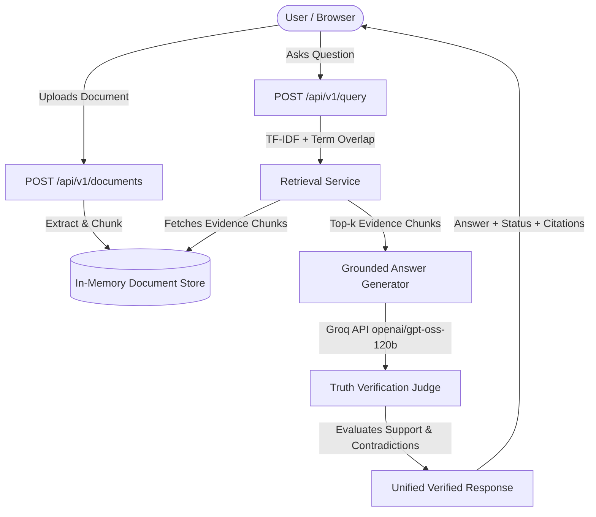

# ModelLens — Ground Truth Intelligence & AI Grounding Engine

> **ModelLens** is an end-to-end AI document intelligence and verification platform. It guarantees factual grounding, prevents hallucinations, extracts citations with exact page numbers, and detects contradictions in real time.

---

## 🎬 Product Demo Showcase (with Voiceover)

Watch the complete **1-minute 35-second** end-to-end walkthrough analyzing an enterprise **Q4 Income Statement**, featuring:
- **Audio Voiceover Narration**: Step-by-step spoken explanation of document ingestion, query grounding, and truth verification.
- **Direct Unboxed Output**: Large, readable typography directly on canvas with zero confining borders.
- **Fact-Check Citations**: Expandable proof drawer revealing cited Page 1 and Page 2 snippets with similarity metrics.

🎥 **Download / Watch Full Video with Audio**: [`modellens_income_demo_with_voiceover.mp4`](modellens_income_demo_with_voiceover.mp4)  
🖼️ **Animated Web Preview**:


---

## 🌟 Key Capabilities

- **Multi-Format Ingestion**: Ingests and processes any document format on the fly:
  - PDF (`.pdf`) via PyMuPDF
  - Microsoft Word (`.docx`) via `python-docx`
  - Plain Text (`.txt`), Markdown (`.md`), CSV (`.csv`), JSON (`.json`), source code
- **Deterministic & Semantic Verification**:
  - **`SUPPORTED`**: Answer is corroborated by source evidence with confidence score and page citations.
  - **`CONTRADICTED`**: Detects when claims conflict with source text (e.g. numeric differences or negated premises).
  - **`NOT_FOUND`**: Deterministically catches out-of-scope questions and flags `INSUFFICIENT_EVIDENCE` instead of hallucinating.
  - **`UNCERTAIN`**: Flags partially answered or ambiguous context.
- **Groq LLM Acceleration**: Powered by Groq's high-speed inference engine (`openai/gpt-oss-120b`) for real-time grounded generation and LLM-as-a-judge evaluation.
- **Minimalist ChatGPT-Style Interface**: High-contrast, clean editorial frontend inspired by modern design standards, complete with drag-and-drop ingestion, source evidence accordions, and zero clutter.

---

## 🏗️ System Architecture



---

## 🚀 Quick Start Guide

### 1. Prerequisites
- Python 3.10+
- Node.js 18+ and npm
- Groq API Key (free tier available at [groq.com](https://console.groq.com))

---

### 2. Backend Setup

1. **Navigate to the backend directory and create a virtual environment**:
   ```bash
   cd backend
   python -m venv venv
   # Windows:
   .\venv\Scripts\activate
   # macOS/Linux:
   source venv/bin/activate
   ```

2. **Install Python dependencies**:
   ```bash
   pip install -r requirements.txt
   ```

3. **Configure Environment Variables**:
   Create a `.env` file in the `backend/` directory:
   ```env
   GROQ_API_KEY=your_groq_api_key_here
   DEFAULT_MODEL=openai/gpt-oss-120b
   ```

4. **Launch the FastAPI Server**:
   ```bash
   uvicorn main:app --port 8000 --reload
   ```
   - API Server: `http://127.0.0.1:8000`
   - Interactive Swagger Docs: `http://127.0.0.1:8000/docs`

---

### 3. Frontend Setup

1. **Navigate to the frontend directory**:
   ```bash
   cd frontend
   ```

2. **Install Node dependencies**:
   ```bash
   npm install
   ```

3. **Start the Development Server**:
   ```bash
   npm run dev
   ```
   - Web App UI: `http://localhost:5173`

---

## 📡 API Reference

### 1. Upload Document
- **Endpoint**: `POST /api/v1/documents`
- **Content-Type**: `multipart/form-data`
- **Payload**: `file` (binary)
- **Response**:
  ```json
  {
    "document_id": "doc_498a30e3ef61",
    "filename": "refund_policy.pdf",
    "pages": 3,
    "status": "ready"
  }
  ```

### 2. Query & Truth Verification
- **Endpoint**: `POST /api/v1/query`
- **Content-Type**: `application/json`
- **Request Body**:
  ```json
  {
    "document_id": "doc_498a30e3ef61",
    "question": "What is the refund period?"
  }
  ```
- **Response Body**:
  ```json
  {
    "query_id": "q_66e285be89a7",
    "answer": "Customers can request a full refund within 30 days of purchase.",
    "status": "SUPPORTED",
    "confidence": 0.95,
    "evidence": [
      {
        "text": "Customers can request a full refund within 30 days of purchase.",
        "page": 1,
        "score": 0.5164
      }
    ],
    "explanation": "Directly supported by document evidence on Page 1.",
    "latency_ms": 1240,
    "diagnosis_source": "LLM_EVALUATOR"
  }
  ```

---

## 🧪 Demo Scenarios

| Scenario | Input Question | Expected Behavior |
| :--- | :--- | :--- |
| **Factual Query** | *"What is the refund period?"* | Status **`SUPPORTED`** with exact 30-day answer and Page 1 excerpt. |
| **Conflict / False Claim** | *"Can I get a refund in 90 days?"* | Status **`CONTRADICTED`**; explains that policy specifies 30 days. |
| **Out of Scope** | *"What is the company's Mars travel policy?"* | Returns `INSUFFICIENT_EVIDENCE` with status **`NOT_FOUND`**. Refuses to hallucinate. |

---

## 🛠️ Technology Stack

- **Backend**: FastAPI, PyMuPDF (`fitz`), `python-docx`, Scikit-Learn (TF-IDF & Cosine Similarity), HTTPX, Pydantic v2, Uvicorn.
- **Inference Engine**: Groq API (`openai/gpt-oss-120b`).
- **Frontend**: React 18, TypeScript, Vite, Tailwind CSS, Lucide Icons.

---

## 📄 License
MIT License. Free for open source and enterprise development.
